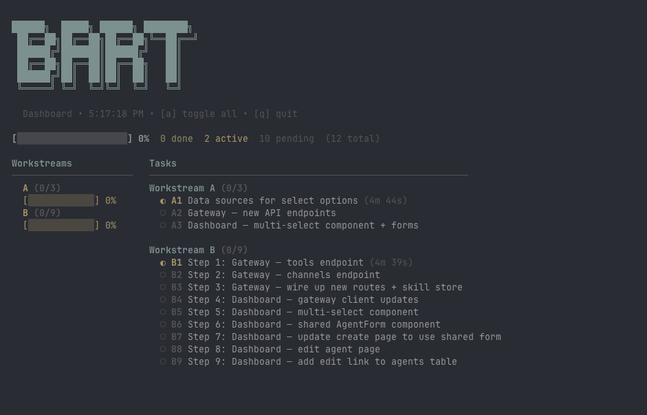

# Bart Loop

**Autonomous task execution loop using AI agents. Break down your project into tasks and let Claude Code or OpenCode execute them — in parallel, across multiple workstreams.**

[](https://www.npmjs.com/package/bart-loop)
[](https://github.com/leandrostoroli/bart-loop)
[](LICENSE)

<br>

*"Stop manually running Claude for every task. Let bart loop through your entire project plan."*

---

## Why Bart?

You're using Claude Code or OpenCode to build. That's great — but running commands manually for each task is slow.

Bart fixes that. It's the automation layer that:

- **Runs your entire project** — One command starts executing all tasks
- **Handles dependencies** — Waits for cross-workstream deps, notifies when blocked
- **Works in parallel** — Run multiple workstreams in separate terminals
- **Manages multiple plans** — Each plan gets isolated task tracking
- **Keeps you informed** — Telegram notifications for task completions, errors, and milestones
- **Thinks before it plans** — Interactive guided exploration to figure out *what* to build

No more:
- Starting Claude for every single task
- Checking which task comes next
- Wondering if something is waiting on another workstream
- Manually tracking progress

---

## Install

```bash
npm install -g bart-loop
# or
bun install -g bart-loop
```

Requires: [Bun](https://bun.sh) or Node.js 18+, [Claude Code](https://docs.anthropic.com/en/docs/claude-code/overview) or [OpenCode](https://opencode.ai).

After installing, set up skills and shell completions:

```bash
bart install
```

---

## Quick Start

```bash
# 1. Initialize bart in your project
bart init

# 2. Think through what you want to build (interactive)
bart think

# 3. Or create a plan.md manually and generate tasks
bart plan

# 4. Run everything
bart run
```

Or use your latest Claude plan directly:
```bash
bart plan --latest
```

---

## How It Works

### 1. Think & Plan

Start with `bart think` to explore your idea interactively — bart guides you through structured discovery, surfaces ambiguities, and writes a plan directly. Or create a `plan.md` manually and convert it with `bart plan`.

### 2. Execute

```bash
bart run
```

Bart:
- Finds the next available task
- Runs Claude Code with `--dangerously-skip-permissions`
- Marks tasks complete automatically
- Continues to the next task

### 3. Parallelize

Run multiple workstreams in separate terminals:

```bash
# Terminal 1
bart run --workstream A

# Terminal 2
bart run --workstream B
```

---

## Commands

| Command | What it does |
|---------|--------------|
| `bart` | Run next available task |
| `bart run` | Run all available tasks (auto-continue) |
| `bart run --no-auto-continue` | Ask after each task |
| `bart run A1` | Run specific task |
| `bart run --workstream B` | Run tasks in workstream B only |
| `bart think` | Interactive guided thinking session |
| `bart think "topic"` | Think session with a starting topic |
| `bart init` | Initialize bart in your project |
| `bart status` | Show progress |
| `bart status --workstream A` | Detailed status for workstream A |
| `bart plans` | List all plan executions with progress |
| `bart dashboard` | TUI dashboard |
| `bart watch` | Auto-refresh dashboard |
| `bart plan` | Generate tasks from plan.md |
| `bart plan --latest` | Generate from latest Claude plan |
| `bart plan --latest -y` | Skip confirmation prompt |
| `bart convert` | Convert latest plan to bart tasks |
| `bart requirements` | Show requirements coverage report |
| `bart specialists` | List discovered specialists |
| `bart specialists new` | Create a new specialist profile (guided) |
| `bart specialists --board` | Show specialist board by effectiveness |
| `bart specialists --history` | Show specialist execution history |
| `bart suggest "<task>"` | Suggest best specialists for a task |
| `bart reset A1` | Reset task A1 to pending |
| `bart completions install` | Install shell tab-completions |
| `bart install` | Install skills and shell completions |
| `bart config` | Show configuration |
| `bart config --telegram` | Setup Telegram notifications |

### Plan Selection

When you have multiple plans, bart auto-selects the most recent one. You can target a specific plan:

```bash
bart status --plan my-feature
bart run --plan my-feature
```

Resolution order:
1. `--tasks <path>` — explicit path (escape hatch)
2. `--plan <slug>` — `.bart/plans/<slug>/tasks.json`
3. Auto-select latest `tasks.json` in `.bart/plans/*/`
4. Fallback to legacy `.bart/tasks.json`

---

## Configuration

```bash
# Show current config
bart config

# Agent selection
bart config --agent claude    # Claude Code (default)
bart config --agent opencode   # OpenCode

# Auto-continue mode
bart config --auto-continue   # Run all tasks automatically (default)
bart config --no-auto-continue  # Ask after each task

# Telegram notifications
bart config --telegram
```

### Notifications

Get notified on task completions, errors, milestones, and workstream status:

**Telegram (Recommended)**
1. Create a bot via [@BotFather](https://t.me/BotFather) on Telegram
2. Get your chat ID (message the bot and check the API)
3. Configure: `bart config --telegram`

Bart sends notifications for:
- Task completions and failures
- Workstream completions and blocks
- Milestone progress (25%, 50%, 75%, 100%)
- Critical errors requiring attention

---

## Shell Completions

Bart supports tab-completion for zsh and bash, including dynamic completion for plan names, workstreams, and task IDs.

```bash
# Auto-detect and install
bart completions install

# Or output scripts directly
bart completions zsh > _bart
bart completions bash > bart.bash
```

Completions are also installed automatically when you run `bart install`.

---

## Thinking Before Planning

Not sure what to build yet? `bart think` starts an interactive session that guides you through structured exploration:

```bash
bart think                    # Open-ended exploration
bart think "auth system"      # Start with a specific topic
```

The session walks you through:
1. **Discovery** — Understanding what you're building
2. **Gray areas** — Surfacing domain-specific ambiguities
3. **Decisions** — Concrete choices with tradeoffs
4. **Scope lock** — Confirming what's in and what's deferred
5. **Plan output** — Writing a bart-format plan directly

When you're done, exit the session. Bart automatically detects the new plan and converts it to tasks — no extra steps needed.

---

## Workstreams

Bart organizes tasks into workstreams (A, B, C, D, E, F) for parallel execution:

| Workstream | Purpose |
|------------|---------|
| A | Foundation (setup, config, core) |
| B | Features (business logic) |
| C | Testing & integration |
| D | Deployment & polish |
| E, F | Additional parallel tracks |

### Dependencies

Tasks can depend on other tasks:

```json
{
  "id": "B2",
  "depends_on": ["A1", "A2"]
}
```

Bart waits automatically and notifies when blocked.

---

## Project Structure

```
your-project/
├── plan.md                 # Your project plan (optional)
└── .bart/
    ├── CONTEXT.md          # Decisions and context from bart think
    └── plans/
        └── <date>-<slug>/
            ├── plan.md     # Plan (from think session or converted)
            └── tasks.json  # Generated tasks
```

---

## Specialists

Bart discovers available AI specialists (skills, agents, CLI tools, profiles) and can route tasks to them:

```bash
bart specialists              # List all discovered specialists
bart specialists --board      # See effectiveness rankings
bart suggest "build auth"     # Get specialist recommendations for a task
```

### Specialist Profiles

Profiles are reusable specialist definitions with domain knowledge, coding standards, and learned patterns. They live as markdown files in `specialists/` (project-level) or `~/.bart/specialists/` (global).

Create one interactively:

```bash
bart specialists new
```

Profiles include:
- **Role & description** — What the specialist does
- **Skills & agents** — Referenced tools the specialist uses
- **Premises** — Domain rules, patterns, and standards
- **Learnings** — Auto-appended entries from task execution (successes and failures)

Bart injects the matched specialist's profile context into agent prompts during task execution, and records learnings back into the profile after each run — so specialists get better over time.

---

## Recommended: Skip Permissions

Bart is designed for frictionless automation. Run with:

```bash
claude --dangerously-skip-permissions
```

Or set in config:
```bash
bart config --agent claude
```

---

## Troubleshooting

**Tasks not running?**
- Check `bart status` for progress
- Use `bart reset <task-id>` to restart a stuck task

**Workstream blocked?**
- Run without `--workstream` flag to process all workstreams
- Or run workstreams in order: A → B → C

**Need to stop?**
- Ctrl+C stops the current task
- Resume anytime with `bart run` — it picks up where you left off

---

## License

MIT — See [LICENSE](LICENSE) for details.

---

<div align="center">

**Let AI do the work. You focus on shipping.**

</div>
