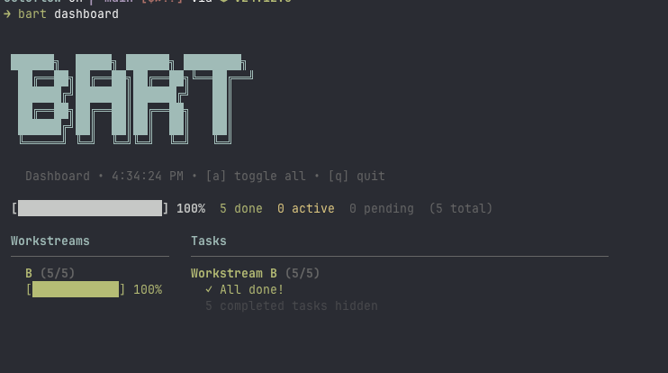

 

# Bart Loop

Autonomous task execution loop using AI agents. Break down your project into tasks and let AI agents execute them in parallel across multiple workstreams.

## Features

- **Parallel Execution** - Run multiple workstreams simultaneously in separate terminals
- **Auto-Retry** - Handles rate limits automatically with smart wait times
- **Live Dashboard** - TUI dashboard shows real-time progress
- **Plan to Tasks** - Generate tasks from a simple `plan.md` file
- **Claude Plan Integration** - Use `bart plan --latest` to find your latest Claude plan
- **Session Resume** - Interrupted tasks can resume from where they left off
- **Auto-Commit** - Automatically commits completed work to git
- **Notifications** - Get notified when workstreams complete or get blocked
- **Cross-Workstream Dependencies** - Tasks can depend on tasks from other workstreams

## Install

```bash
npm install -g bart-loop
# or
bun install -g bart-loop
```

Requires: [Bun](https://bun.sh) or Node.js 18+, [OpenCode](https://opencode.ai) or [Claude Code](https://docs.anthropic.com/en/docs/claude-code/overview).

## Quick Start

```bash
# 1. Create a plan.md in your project
cat > plan.md << 'EOF'
# My Project

## Setup
### Initialize project
### Configure TypeScript

## Backend
### Create API
### Add database

## Frontend
### Build UI
### Style components
EOF

# 2. Generate tasks from plan
bart plan

# 3. Run tasks
bart
```

Or use your latest Claude plan:
```bash
bart plan --latest
```

## Usage

```bash
bart                    # Run next available task
bart run              # Run all available tasks (auto-continue)
bart run --no-auto-continue  # Ask after each task
bart status            # Show progress
bart status --workstream A   # Show detailed status for workstream A
bart dashboard         # Live TUI dashboard
bart watch            # Auto-refresh dashboard
bart plan             # Generate tasks from plan.md
bart plan --latest    # Generate from latest Claude plan
bart plan --latest -y # Generate from latest Claude plan (no prompt)
bart run A1           # Run specific task
bart run --workstream B  # Run tasks in workstream B
bart reset A1          # Reset task A1 to pending
bart config           # Show config
bart config --agent claude  # Set default agent
bart config --notify-url "https://api.day.app/YOUR_KEY/"  # Set notifications
```

## Notifications

Bart can send notifications when:
- A workstream completes
- A workstream gets blocked waiting on another workstream

### Mac Notifications
Native macOS notifications work automatically. Enable "Sync to this iPhone" in Notification settings to receive on iOS.

### iOS via Bark (Recommended)
1. Install [Bark](https://apps.apple.com/app/bark/) on iPhone (free)
2. Get your key from the app
3. Configure: `bart config --notify-url "https://api.day.app/YOUR_KEY/"`

### iOS via Shortcuts
1. Create a Shortcut with "Ask for Input" → "Show Notification"
2. Get the shortcut URL
3. Configure: `bart config --notify-url "shortcuts://run-shortcut?name=Bart+Alert"`

## Parallel Execution

Run multiple workstreams in separate terminals:

```bash
# Terminal 1
bart --workstream A

# Terminal 2
bart --workstream B

# Terminal 3
bart --workstream C
```

Or run all workstreams in one terminal:
```bash
bart run
```

## Configuration

```bash
# Show current config
bart config

# Agent selection
bart config --agent claude    # Use Claude Code (default)
bart config --agent opencode   # Use OpenCode

# Auto-continue (run all tasks automatically)
bart config --auto-continue   # Enable (default)
bart config --no-auto-continue  # Disable (ask after each task)

# Notifications
bart config --notify-url "https://api.day.app/YOUR_KEY/"
```

## How It Works

1. **Plan** - Create a `plan.md` with your project tasks (or use Claude's plan mode)
2. **Generate** - Bart converts the plan into executable tasks
3. **Execute** - AI agents work through tasks in parallel
4. **Complete** - Tasks are marked complete and notifications sent

### Workstream Strategy

- **A** - Foundation (setup, config, core)
- **B** - Features (business logic)
- **C** - Testing & integration
- **D** - Deployment & polish
- **E, F** - Additional parallel workstreams

### Task Dependencies

Tasks can depend on other tasks:

```json
{
  "id": "B2",
  "depends_on": ["A1", "A2"]
}
```

Bart will automatically wait for dependencies and notify when blocked.

## Project Structure

```
your-project/
├── plan.md                 # Your project plan
└── .bart/
    ├── tasks.json          # Generated tasks
    ├── plan.md            # Copied plan
    ├── logs/               # Execution logs
    └── .locks/             # Parallel execution locks
```

## License

MIT
