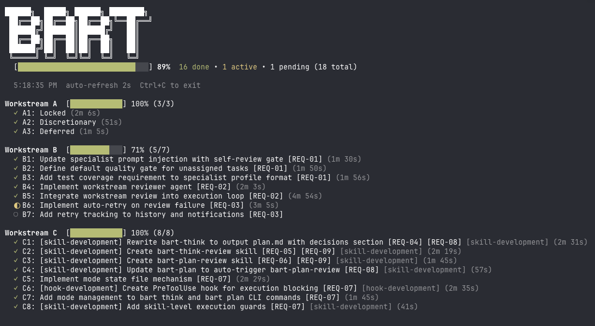

<p align="center">
  
</p>

# Bart Loop

**Autonomous task execution loop using AI agents. Break down your project into tasks and let Claude Code or OpenCode execute them — in parallel, across multiple workstreams, with built-in TDD enforcement and quality gates.**

[](https://www.npmjs.com/package/bart-loop)
[](https://github.com/leandrostoroli/bart-loop)
[](LICENSE)

<br>

*"Stop manually running Claude for every task. Let bart loop through your entire project plan."*

---

## Why Bart?

You're using Claude Code or OpenCode to build. That's great — but running commands manually for each task is slow, and there's no quality control.

Bart fixes that. It's the automation layer that:

- **Runs your entire project** — One command starts executing all tasks
- **Enforces TDD** — Every task follows RED-GREEN-REFACTOR with evidence requirements
- **Generates rich task files** — Each task gets a markdown file with scope, DoD, and tests
- **Reviews its own work** — Self-review per task, workstream-level review, auto-retry on failure
- **Persists review feedback** — Rejection reasons saved in task files, creating an audit trail
- **Handles dependencies** — Waits for cross-workstream deps, notifies when blocked
- **Works in parallel** — Run multiple workstreams in separate terminals
- **Routes to specialists** — ML-based matching learns which specialist fits each task
- **Tracks requirements** — Bidirectional mapping from requirements to tasks with coverage reports
- **Keeps you informed** — Telegram notifications for completions, errors, and milestones
- **Exposes a REST API** — Query task status and progress programmatically
- **Thinks before it plans** — Interactive guided exploration to figure out *what* to build

No more:
- Starting Claude for every single task
- Checking which task comes next
- Wondering if something is waiting on another workstream
- Manually tracking progress
- Hoping the AI wrote tests

---

## Install

```bash
npm install -g bart-loop
# or
bun install -g bart-loop
```

Requires: [Bun](https://bun.sh) or Node.js 18+, [Claude Code](https://docs.anthropic.com/en/docs/claude-code/overview) or [OpenCode](https://opencode.ai).

After installing, set up skills and shell completions:

```bash
bart install
```

---

## Quick Start

```bash
# 1. Initialize bart in your project
bart init

# 2. Think through what you want to build (interactive)
bart think

# 3. Or create a plan.md manually and generate tasks
bart plan

# 4. Run everything
bart run
```

Or use your latest Claude plan directly:
```bash
bart plan --latest
```

---

## How It Works

### 1. Think & Plan

Start with `bart think` to explore your idea interactively — bart guides you through structured discovery, surfaces ambiguities, and writes a TDD-structured plan directly. Or create a `plan.md` manually and convert it with `bart plan`.

Plans go through an automatic review pipeline:
- **bart-think** writes the plan → **bart-think-review** validates decisions and coverage → **bart-plan** structures it → **bart-plan-review** checks format compliance

Each step auto-chains to the next. You approve at each gate.

### 2. Execute

```bash
bart run
```

For each task, bart:
- Finds the next available task (respecting dependencies)
- Loads the task's markdown file (`task-{id}.md`) with scope, tests, and Definition of Done
- Matches and injects the best specialist's context
- Enforces TDD: write failing test → implement → verify pass
- Runs self-review against the task's Definition of Done checklist
- Marks tasks complete and continues

### 3. Review

After all tasks in a workstream complete, a dedicated reviewer agent validates:
- Requirements coverage — all referenced `[REQ-XX]` items met
- Test coverage — all tasks have tests, critical paths covered
- Code quality — cross-task consistency, no conflicts

On failure: review feedback is persisted directly in `task-{id}.md`, auto-retry up to 2x with feedback injected. After that: escalate to you.

### 4. Parallelize

Run multiple workstreams in separate terminals:

```bash
# Terminal 1
bart run --workstream A

# Terminal 2
bart run --workstream B
```

---

## Task Markdown Files

When you run `bart plan`, bart generates a structured `task-{id}.md` file for each task alongside `tasks.json`. These markdown files give agents richer context than a JSON title and description alone.

Each task file contains:

```markdown
## Scope
What the task does and doesn't do.

## Requirements
Which [REQ-XX] items this task covers.

## Definition of Done
- [ ] Specific, measurable completion criteria
- [ ] Used by the self-review gate as a checklist

## Tests
Expanded test code with setup and assertions.
```

During execution, bart extracts the **Definition of Done** and injects it into the agent's self-review gate — so the agent verifies each criterion before marking the task done.

When a workstream review rejects a task, feedback is appended to the same file:

```markdown
## Review Feedback

### Attempt 1 — REJECTED
- Missing error handling for invalid tokens
- Test doesn't cover edge case

### Attempt 2 — REJECTED
- Error handling added but test still incomplete

### Resolved
```

This creates a full audit trail of review cycles in each task file.

---

## Commands

| Command | What it does |
|---------|--------------|
| `bart` | Run next available task |
| `bart run` | Run all available tasks (auto-continue) |
| `bart run --no-auto-continue` | Ask after each task |
| `bart run A1` | Run specific task |
| `bart run --workstream B` | Run tasks in workstream B only |
| `bart think` | Interactive guided thinking session |
| `bart think "topic"` | Think session with a starting topic |
| `bart init` | Initialize bart in your project |
| `bart status` | Show progress |
| `bart status --workstream A` | Detailed status for workstream A |
| `bart plans` | List all plan executions with progress |
| `bart dashboard` | TUI dashboard |
| `bart watch` | Auto-refresh dashboard |
| `bart plan` | Generate tasks from plan.md |
| `bart plan --latest` | Generate from latest Claude plan |
| `bart plan --latest -y` | Skip confirmation prompt |
| `bart convert` | Convert latest plan to bart tasks |
| `bart requirements` | Show requirements coverage report |
| `bart requirements --gaps` | Show only uncovered requirements |
| `bart specialists` | List discovered specialists |
| `bart specialists new` | Create a new specialist profile (guided) |
| `bart specialists --board` | Show specialist board by effectiveness |
| `bart specialists --history` | Show specialist execution history |
| `bart specialists git` | Mine engineering standards from git history & PRs |
| `bart specialists git --since 3m` | Scan with time window (default: 6m) |
| `bart suggest "<task>"` | Suggest best specialists for a task |
| `bart reset A1` | Reset task A1 to pending |
| `bart stop` | Gracefully stop a running bart process |
| `bart completions install` | Install shell tab-completions |
| `bart install` | Install skills and shell completions |
| `bart config` | Show configuration |
| `bart config --telegram` | Setup Telegram notifications |

<p align="center">
  
</p>

### Plan Selection

When you have multiple plans, bart auto-selects the most recent one. You can target a specific plan:

```bash
bart status --plan my-feature
bart run --plan my-feature
```

Resolution order:
1. `--tasks <path>` — explicit path (escape hatch)
2. `--plan <slug>` — `.bart/plans/<slug>/tasks.json`
3. Auto-select latest `tasks.json` in `.bart/plans/*/`
4. Fallback to legacy `.bart/tasks.json`

---

## TDD Enforcement

Bart enforces test-driven development at every level — from planning through execution.

### In Plans

Plans include a `## Testing` metadata section that captures your project's test setup:

```markdown
## Testing
Test command: npm test
Framework: vitest
Conventions: tests in __tests__/, named *.test.ts
```

Every task follows a three-part structure:

```markdown
### Implement user authentication [REQ-01]

**Test first:**
- Create `tests/auth.test.ts`
- Run: `npm test -- tests/auth.test.ts`
- Expected: FAIL

**Implementation:**
- Modify `src/auth.ts`
- Add session management

**Verify:**
- Run: `npm test -- tests/auth.test.ts`
- Expected: PASS
```

### During Execution

Each task's agent prompt includes a mandatory TDD protocol:
1. Write the failing test first
2. Run it — verify it fails (show output)
3. Write minimal implementation to make it pass
4. Run the test again — verify it passes (show output)
5. Commit test and implementation together

The agent must show **actual test command output** as evidence — no assumptions accepted.

### In Specialist Profiles

Every specialist profile includes a `### Testing Protocol` section with RED-GREEN-REFACTOR rules plus domain-specific testing guidance. The `test_expectations` from the profile are injected into the self-review gate.

---

## Quality Gates & Review Pipeline

Bart uses a three-layer review system to catch issues before they compound.

### Layer 1: Self-Review (Per Task)

Built into every task's execution prompt. The agent checks its own work against:
- **Definition of Done** — Task-specific acceptance criteria extracted from `task-{id}.md`
- **Scope compliance** — Is the output within scope? Does it solve the stated problem?
- **Code quality** — Follows existing patterns, no unnecessary dependencies, minimal changes
- **TDD evidence** — Tests written first, fail/pass verified with actual output
- **Completeness** — All files listed, duration recorded

### Layer 2: Workstream Review (After All Tasks Complete)

A dedicated reviewer agent validates the entire workstream:
- Requirements coverage — all `[REQ-XX]` markers fully addressed
- Test coverage — all tasks have tests, critical paths covered
- Code quality — cross-task consistency, no file conflicts, merge-ready

Verdict: **PASS** or **FAIL** with specific issues listed.

### Layer 3: Auto-Retry & Escalation

When a workstream review fails:
1. **Retry 1** — Review feedback persisted in `task-{id}.md`, failed tasks re-run with feedback visible
2. **Retry 2** — Final attempt with escalation context
3. **Escalation** — Tasks marked `needs_escalation`, reported to you via Telegram
4. **Resolved** — When a task passes, a `### Resolved` marker is appended to close the feedback loop

Task statuses: `pending` → `in_progress` → `completed` | `error` | `needs_escalation`

---

## Requirements Tracking

Plans define explicit requirements that bart tracks through execution.

### Defining Requirements

```markdown
## Requirements
- [REQ-01] Users can log in with email and password
- [REQ-02] Sessions expire after 24 hours
- [REQ-03] Failed logins are rate-limited
```

Tasks reference requirements in their headings:

```markdown
### Implement login endpoint [REQ-01]
### Add session expiry [REQ-02]
### Rate limit failed attempts [REQ-03]
```

### Coverage Reports

```bash
bart requirements              # Full coverage report
bart requirements --gaps       # Show only uncovered/partial requirements
```

The report shows total requirements vs covered/partial/uncovered, with a breakdown per requirement and its implementing tasks.

---

## Thinking Before Planning

Not sure what to build yet? `bart think` starts an interactive session that guides you through structured exploration:

```bash
bart think                    # Open-ended exploration
bart think "auth system"      # Start with a specific topic
```

The session walks you through:
1. **Discovery** — Understanding what you're building
2. **Gray areas** — Surfacing domain-specific ambiguities
3. **Decisions** — Concrete choices with tradeoffs
4. **Scope lock** — Confirming what's in and what's deferred
5. **Plan output** — Writing a TDD-structured bart-format plan with test discovery

Bart discovers your project's test setup (package.json scripts, existing test files, CI config) and populates the `## Testing` section automatically.

After writing the plan, bart auto-chains through the review pipeline:
`bart-think` → `bart-think-review` → `bart-plan` → `bart-plan-review` → ready for `bart run`

---

## Workstreams

Bart organizes tasks into workstreams (A, B, C, D, E, F) for parallel execution:

| Workstream | Purpose |
|------------|---------|
| A | Foundation (setup, config, core) |
| B | Features (business logic) |
| C | Testing & integration |
| D | Deployment & polish |
| E, F | Additional parallel tracks |

### Dependencies

Tasks can depend on other tasks:

```json
{
  "id": "B2",
  "depends_on": ["A1", "A2"]
}
```

Bart waits automatically and notifies when blocked.

---

## Specialists

Bart discovers available AI specialists and routes tasks to the best match.

### Discovery

Bart scans multiple sources for specialists:
- `.bart/specialists/*.md` — Project-local profiles
- `~/.bart/specialists/*.md` — Global profiles
- `.claude/commands/` — Claude Code commands
- `.claude/agents/` — Claude Code agents
- CLI tools on PATH

```bash
bart specialists              # List all discovered specialists
bart specialists --board      # See effectiveness rankings
bart specialists --history    # Execution history with completion rates
bart suggest "build auth"     # Get specialist recommendations for a task
```

### Specialist Profiles

Profiles are reusable specialist definitions with domain knowledge, coding standards, and learned patterns.

Create one interactively:

```bash
bart specialists new
```

A profile includes:
- **Role & description** — What the specialist does
- **Skills & agents** — Referenced tools the specialist uses
- **Premises** — Domain rules, patterns, and standards (10-30 imperative rules)
- **Testing Protocol** — RED-GREEN-REFACTOR rules + domain-specific testing guidance
- **Test expectations** — Verification items injected into the self-review gate
- **Learnings** — Auto-appended entries from task execution (successes and failures)

Bart injects the matched specialist's full context into agent prompts during task execution, and records learnings back into the profile after each run — so specialists get better over time.

### ML-Based Matching

After 5+ task-specialist pairings, bart trains a feature similarity model:
- **Features**: file extensions, keywords, complexity (file count), workstream
- **Learning**: success/failure of each pairing feeds back into confidence scores
- **Board**: `bart specialists --board` ranks specialists by completion rate, reset rate, and average duration

### Mining Standards from Git

Discover engineering standards your team already follows:

```bash
bart specialists git                 # Scan last 6 months of PRs
bart specialists git --since 3m      # Custom time window
```

Bart analyzes PR review comments and commit diffs, extracts patterns where engineers corrected each other, clusters findings by domain, and recommends new specialist profiles to create.

---

## Configuration

```bash
# Show current config
bart config

# Agent selection
bart config --agent claude    # Claude Code (default)
bart config --agent opencode   # OpenCode

# Auto-continue mode
bart config --auto-continue   # Run all tasks automatically (default)
bart config --no-auto-continue  # Ask after each task

# Telegram notifications
bart config --telegram
```

### Notifications

Get notified on task completions, errors, milestones, and workstream status:

**Telegram (Recommended)**
1. Create a bot via [@BotFather](https://t.me/BotFather) on Telegram
2. Get your chat ID (message the bot and check the API)
3. Configure: `bart config --telegram`

Bart sends notifications for:
- Task completions and failures
- Workstream completions and blocks
- Workstream review verdicts (PASS/FAIL)
- Review escalations requiring manual intervention
- Milestone progress (25%, 50%, 75%, 100%)
- Critical errors requiring attention

---

## REST API

Bart includes a lightweight HTTP server for querying task status and progress programmatically — useful for dashboards, CI integrations, or external monitoring.

### Endpoints

| Endpoint | Description |
|----------|-------------|
| `GET /tasks` | List all tasks (supports `?status=` and `?workstream=` filters) |
| `GET /tasks/:id` | Get a single task by ID |
| `GET /progress` | Progress summary: total, completed, in_progress, pending, error |
| `GET /requirements` | Requirements coverage status |

### Authentication

The API supports optional bearer token authentication. When enabled, all requests must include:

```
Authorization: Bearer <token>
```

Auth is disabled by default (no tokens configured). When enabled, unauthenticated requests receive a 401 response.

---

## Shell Completions

Bart supports tab-completion for zsh and bash, including dynamic completion for plan names, workstreams, and task IDs.

```bash
# Auto-detect and install
bart completions install

# Or output scripts directly
bart completions zsh > _bart
bart completions bash > bart.bash
```

Completions are also installed automatically when you run `bart install`.

---

## Project Structure

```
your-project/
├── plan.md                    # Your project plan (optional)
└── .bart/
    ├── CONTEXT.md             # Decisions and context from bart think
    ├── config.json            # Project-level config overrides
    ├── history.jsonl           # Task completion/error/reset event log
    ├── specialist-model.json   # ML model for specialist matching
    ├── specialists.md          # Discovered specialists roster
    ├── specialists/            # Project-local specialist profiles
    │   └── <name>.md
    └── plans/
        └── <date>-<slug>/
            ├── plan.md         # Plan (from think session or converted)
            ├── tasks.json      # Generated tasks
            ├── task-A1.md      # Task markdown with scope, DoD, tests
            ├── task-A2.md
            └── ...
```

---

## Plan Format

Plans follow a structured format that the parser understands:

```markdown
# Plan: My Feature

## Requirements
- [REQ-01] First requirement
- [REQ-02] Second requirement

## Testing
Test command: npm test
Framework: vitest
Conventions: tests in __tests__/, named *.test.ts

## Foundation
### Setup database schema [REQ-01]
Files: src/db/schema.ts, tests/db/schema.test.ts

**Test first:**
...

**Implementation:**
...

**Verify:**
...

### [backend-specialist] Create API endpoints [REQ-01] [REQ-02]
Files: src/api/routes.ts, tests/api/routes.test.ts
```

Key format rules:
- `## Requirements` — Defines trackable requirements with `[REQ-XX]` IDs
- `## Testing` — Captures test command, framework, and conventions
- `##` section headings — Define workstream boundaries (sections 1-2 → A, 3-4 → B, etc.)
- `###` task headings — Individual tasks with optional `[specialist-name]` and `[REQ-XX]` tags
- `Files:` line — File references for dependency detection
- Dependency keywords ("depends", "after", "requires") — Create task dependency links

---

## Recommended: Skip Permissions

Bart is designed for frictionless automation. Run with:

```bash
claude --dangerously-skip-permissions
```

Or set in config:
```bash
bart config --agent claude
```

---

## Troubleshooting

**Tasks not running?**
- Check `bart status` for progress
- Use `bart reset <task-id>` to restart a stuck task

**Workstream blocked?**
- Run without `--workstream` flag to process all workstreams
- Or run workstreams in order: A → B → C

**Need to stop?**
- `bart stop` sends a graceful stop signal from another terminal
- Ctrl+C stops the current task
- Resume anytime with `bart run` — it picks up where you left off

**Review keeps failing?**
- Check `bart status` for tasks marked `needs_escalation`
- Fix the flagged issues manually, then `bart reset <task-id>` and re-run

---

## License

MIT — See [LICENSE](LICENSE) for details.

---

<div align="center">

**Let AI do the work. You focus on shipping.**

</div>
